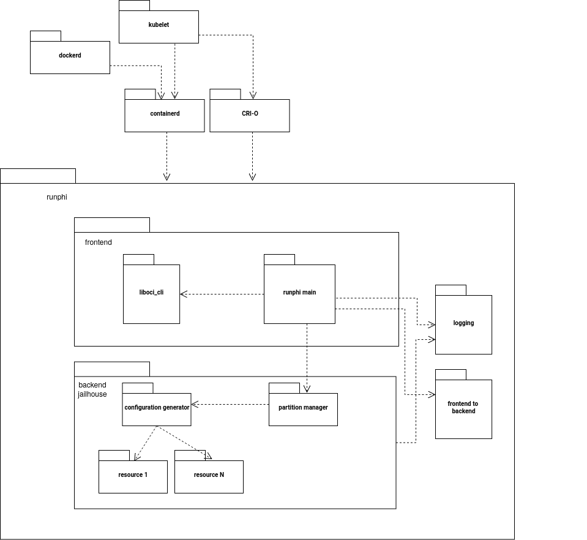

## Repo Structure

- doc, with the current documentation
- logo, well, the name is self-explanatory
- CNI, with a Container Network Interface to integrate the Kubernetes networking with the hypervisor one (it assumes having two VMs communicating over network interfaces, still experimental)
- docker, with the files required to containerize the building process
- rust_runphi, with the actual source tree for the container runtime
- target, with files that are necessary to integrate runPHI in the environment built with our environment builder

## Build runPHI

If you want to build runPHI for aarch64, try: 

    cd rust_runphi
    ./compile_rust.sh 
    
That requires a Rust toolchain. If you do not want to install one, use the Docker script to run those commands in a container.

    docker/start_container.sh
    

## Debug runPHI

export RUNPHI_DEBUG_LEVEL={level}

where {level} can be "error", "warn", "info", "debug", "trace"

Export the variable in an environment such that containerd (or any other program that calls runPHI) can inherit the variable.
For example, export it and then from the shell, restart containerd, or manually launch containerd.

runPHI logs by default in /usr/share/runPHI/log.txt
Note that the folder must be populated with other useful files. So you have to have it in your environment. The files are copied from the target directory in the root of this repo to the target environment by our environment builder. Look for more info there.

## RunPHI Architecture

RunPHI is written in Rust and divided into the following crates:

- runphi: containing the main function of the program. It is hypervisor-independent. To make the ZICs visible to common tools, the creation of the pause container is forwarded to runc_vanilla to create a pause container.
- logging: a crate used by every other crate to handle logging systematically.
- liboci_cli: to parse OCI command line arguments into data structures.
- frontend_to_backend: contains data structures that parse the config.json in /boot/ of the ZICs and other information from the frontend of runPHI into data structures that work as APIs for the backend part, which is hypervisor-dependent. In other words, both the frontend and backend agree on the format of these data structures, and they both use them.
- backend_{backend_name}: a folder for each backend supported. At the moment, Jailhouse is the only stable and tested backend.
The backend usually contains:
- a config_generator, which drives the generation of configuration files for the partitioned container, relying on a hypervisor-dependent backend
- resource files: called by the config_generator, managers of the available resources of the hardware platform, and called to create the config file
For Jailhouse, there is a file for each of the following resources: CPU, memory, RPUs, devices, communication, network, and other boot parameters. 
- template manager: The configuration is based on a template that is provided for the hardware platform. A file takes care of loading such templates.

The backend calls the resource managers and some helper functions (config_generator_helper_start, //_end ), and implements the functions to start, stop, delete, and kill the ZIC, with implementation that strongly depends on the hypervisor.

RunPHI generates some files for each ZIC to keep track of their information (like the cell configuration file and compiled configuration). They can be found in /run/runPHI/<ContainerName>/

## Workflow

RunPHI uses a file that is populated with ID of containers to understand which container command must be redirected to runc.
Some filter conditions are used to understand whether to forward or not.
RunPHI reads a file inside the container called /boot/configuration.json to understand boot parameters to create the configuration for the partitioned cell.
This file must point to the binary or to the kernels required to start the system.
Flow:

1. containerd calls runPHI
2. runPHI parses the bundle given by the upper layer and dispatches to the right OCI commands
3. the OCI command is executed, and if required, it calls the intermediate frontend layer (e.g., config generator)
    - Example:
        - OCI create generates the configuration file, then the mount backend utility, and then the create-guest backend utility
        - The configuration file creation call in order to start the start_helper, then all of the frontend/backend resource managers, and finally the end_helper
        - With jailhouse no-linux, the create-guest call jailhouse cell create passing the cellfile, later jailhouse cell load, and jailhouse cell create

## Demo

**qemu-jailhouse** environment: refer to this [README](https://github.com/runphi/partitioned_container_demos?tab=readme-ov-file#example-zephyr-based-zic-images-for-qemu-hardware-platform-targeting-jailhouse-hypervisor).

