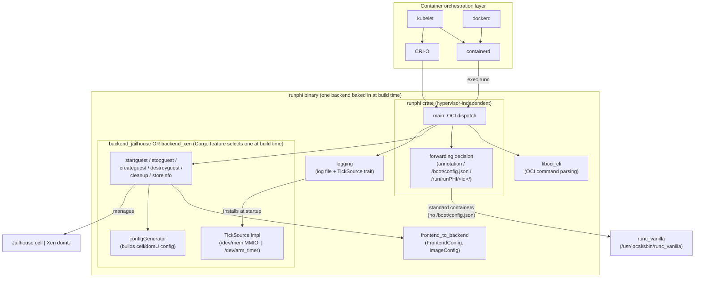

# runPHI — Architecture and internals

A deeper-dive companion to the top-level [README](../README.md). Read that first for what runPHI is, how to build it, and the user-facing workflow. This document covers the internals: what each crate does, how the OCI lifecycle is dispatched, how the forwarding-to-runc decision is made, and where the on-disk state lives.

## Architecture



Walking the diagram:

- **One binary, one backend.** `runphi` is a single binary; which hypervisor backend is compiled in is decided by Cargo features (`jailhouse` default, or `--features xen`). `runphi --version` prints which one. There is no runtime backend switch.
- **Hypervisor-independent core.** Everything in the `runphi`, `logging`, `liboci_cli`, and `frontend_to_backend` crates is the same regardless of backend. The active backend is re-exported at the `runphi` crate root as `backend`, so the rest of the codebase calls `backend::createguest(...)` without knowing which one it is.
- **Forwarding fork.** Before runPHI takes ownership of a container, `forwarding` decides whether the OCI call should be handled here or forwarded to vanilla runc. Decision rules in order: (1) explicit OCI annotation `org.runphi.runtime`, (2) at `create`, presence of `/boot/config.json` in the rootfs, (3) for later commands, presence of `/run/runPHI/<id>/`.
- **TickSource boundary.** The `logging::timer` module is hypervisor-independent, but its tick source is not. Each backend implements a tiny `TickSource` trait (one method, `read_ticks() -> u64`) and the backend's `timer::install()` is called once from `main`. After that, `timer::capture()` works the same way everywhere.

## Crate layout

| Crate | Hypervisor-aware? | Purpose |
|---|---|---|
| `runphi` | no | Binary. Parses OCI args, decides forwarding, dispatches to the backend, owns `main()`. |
| `liboci_cli` | no | OCI command-line parsing. Subset of the OCI runtime spec. |
| `frontend_to_backend` | no | Shared data structures (`FrontendConfig`, `ImageConfig`) used as the API between `runphi` and any backend. Parses `/boot/config.json` from the container rootfs. |
| `logging` | no | Log file writer; `timer` module with the `TickSource` trait and `u64` tick API. |
| `backend_jailhouse` | yes | Jailhouse backend: drives `jailhouse cell {create,load,start}`, MMIO mmap of `/dev/mem` for the timer. |
| `backend_xen` | yes | Xen backend: drives `xl create/unpause/destroy`, reads `/dev/arm_timer` for the timer. |

The two backend crates expose the same seven items (`startguest`, `stopguest`, `destroyguest`, `cleanup`, `createguest`, `storeinfo`, plus the `configGenerator` module). Adding a new backend means producing the same surface. See `rust_runphi/README.md` § *Adding a new hypervisor backend* for the step-by-step recipe.

## Lifecycle of a partitioned container

containerd (or CRI-O, or any OCI-compliant runtime client) execs `/usr/bin/runc` for every container lifecycle event. Because the `switch_to_runphi.sh` script replaced the distro's `runc` with runPHI, containerd is actually invoking us. The dispatch in `runphi/src/main.rs` looks like this for each OCI command:

```
create  → read bundle config.json → forwarding::decide_create
         → (forward to runc_vanilla and exit)  OR
           (mkdir /run/runPHI/<id>/ → frontend::commands::create
            → backend::createguest → backend::storeinfo)

start   → forwarding::decide_existing (checks /run/runPHI/<id>/)
         → forward  OR  frontend::commands::start → backend::startguest

kill    → same forwarding check  →  backend::stopguest + backend::destroyguest
delete  → same forwarding check  →  backend::stopguest + backend::destroyguest + backend::cleanup
state   → same forwarding check  →  read bundle/pidfile/rootfs from /run/runPHI/<id>/
```

`createguest` is the heavy step. On Jailhouse it calls `jailhouse cell create` with the cell config produced by `configGenerator`, then `jailhouse cell load` for the inmate binary. On Xen it builds a domU config and calls `xl create -p` (paused), with `startguest` later running `xl unpause`.

## On-disk state

| Path | Created by | Contents |
|---|---|---|
| `/usr/share/runPHI/log.txt` | `logging::init_logger` | All runPHI log lines and (optionally) timer phase markers. |
| `/run/runPHI/<id>/` | `runphi/src/main.rs` on `create` | Per-container working dir. Its presence is the source of truth for "this is a runPHI-managed container" in subsequent OCI commands. |
| `/run/runPHI/<id>/bundle` | `backend::storeinfo` | Absolute path to the OCI bundle. |
| `/run/runPHI/<id>/pidfile` | `backend::storeinfo` | Path to the container's pidfile (the init process). |
| `/run/runPHI/<id>/rootfs` | `backend::storeinfo` | Absolute path to the mounted rootfs. |
| `/run/runPHI/<id>/config<id>.conf` | backend `configGenerator` | Hypervisor-specific config: the Jailhouse `.c` cell file or the Xen domU config, depending on backend. |
| `<rootfs>/boot/config.json` | container image (input, not produced by us) | Boot parameters for the partitioned cell: which kernel/inmate to load, OS variant, devices, memory layout, etc. Parsed by `frontend_to_backend::ImageConfig::get_from_file`. |
| `/usr/local/sbin/runc_vanilla` | `switch_to_runphi.sh` | Backup of the distro's original `runc`, executed when runPHI forwards a non-runPHI container. |

## Container boot config (`/boot/config.json`)

A runPHI-managed container ships a `/boot/config.json` in its rootfs. Its
presence is the marker that makes `forwarding` keep the container instead of
forwarding it to runc, and `frontend_to_backend::ImageConfig::get_from_file`
parses it. The `os_var` field selects the kind of guest the Xen backend builds.

**Bare-metal inmate** (Zephyr or any single binary):

```json
{ "os_var": "zephyr", "inmate": "/boot/hello.bin", "net": "no" }
```

The backend emits a minimal domU config: `kernel = "<rootfs>/boot/hello.bin"`,
the cpu/memory stanzas, and (on ARM) `gic_version="v2"`.

**Linux domU** (kernel + initramfs):

```json
{ "os_var": "linux", "inmate": "/boot/Image", "ramdisk": "/boot/rootfs.cpio.gz", "net": "no" }
```

The container must ship a kernel `Image` and a `rootfs.cpio.gz` initramfs under
`/boot`. `inmate` is the kernel, `ramdisk` is the initramfs that becomes the
guest's root filesystem (root runs from RAM — no virtual disk, no host LVM). For
this the backend additionally emits, on top of the bare-metal stanza:

- `type = "pvh"` — only on x86 (`xl` on x86 needs an explicit PVH boot type;
  ARM has a single guest type and omits it).
- `ramdisk = "<rootfs>/boot/rootfs.cpio.gz"`.
- `extra = "console=hvc0"` — kernel command line; the console is routed to the
  Xen PV console so `xl console <id>` shows the boot.

On x86, `gic_version` is never emitted (it is an ARM GIC concept that `xl`
rejects on x86). A bare-metal container's generated config is unchanged on ARM.

## Pointers into the code

- OCI dispatch: [rust_runphi/crates/runphi/src/main.rs](../rust_runphi/crates/runphi/src/main.rs)
- Forwarding decision: [rust_runphi/crates/runphi/src/forwarding.rs](../rust_runphi/crates/runphi/src/forwarding.rs)
- Frontend command handlers: [rust_runphi/crates/runphi/src/frontend/commands.rs](../rust_runphi/crates/runphi/src/frontend/commands.rs)
- Shared backend API types: [rust_runphi/crates/frontend_to_backend/src/lib.rs](../rust_runphi/crates/frontend_to_backend/src/lib.rs)
- Timer trait: [rust_runphi/crates/logging/src/timer.rs](../rust_runphi/crates/logging/src/timer.rs)
- Jailhouse backend: [rust_runphi/crates/backend_jailhouse/src/lib.rs](../rust_runphi/crates/backend_jailhouse/src/lib.rs)
- Xen backend: [rust_runphi/crates/backend_xen/src/lib.rs](../rust_runphi/crates/backend_xen/src/lib.rs)

## Historical references

An earlier version of the codebase carried a `runphi/src/unused/` tree
with three groups of dead scaffolding never wired into the build:

- `workload/` — wasmtime / wasmer / wasmedge integration sketches for
  running WASM workloads as the in-container payload.
- `commands/` — per-OCI-command stubs (`create`, `start`, `kill`, ...)
  in the youki/runc-style of one file per command, before the current
  consolidated dispatch in `runphi/src/main.rs`.
- `observability.rs`, `rootpath.rs` — standalone helper modules.

These files were removed to keep the active source tree small. They
are recoverable from git history if anyone wants to revive the WASM
workload work or use the per-command layout as a starting point for
new OCI command implementations.
